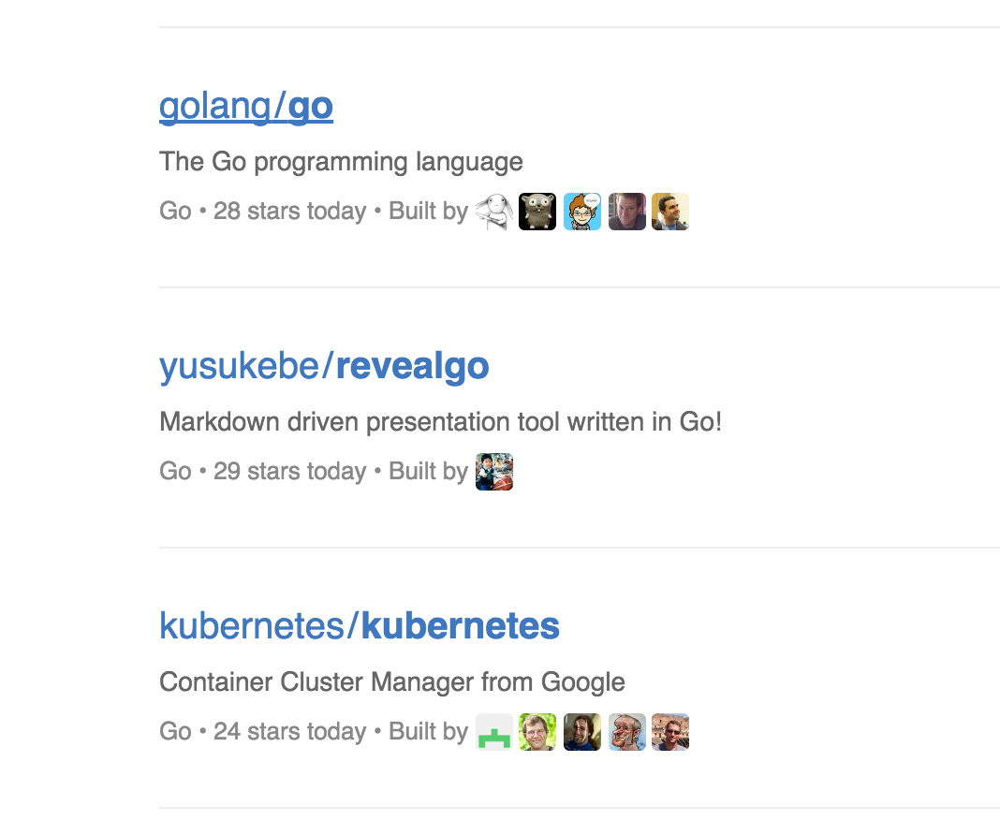

# `revealgo`

[Shibuya.go#1](http://shibuyago.connpass.com/event/25852/)

Yusuke Wada a.k.a. _yusukebe_

---

## Me :-)

- Yusuke Wada
- @yusukebe
- Web application developer
- Technical advisor
- Co-founder of [bokete.jp](http://bokete.jp/)
- Podcast [#wadafm](http://wada.fm/) [#dandyfm](http://danfy.fm/)

---

# BOKETE??

---


---

# #wadafm??

---


---

> `revealgo` is my first Golang GitHub public project

---

## What's `revealgo`??


<https://github.com/yusukebe/revealgo>

---

### Markdown driven presentation tool

> This slides are shown by **revealgo**!

---

## How to make presentation

1. Write Markdown file
2. Run `revealgo` command
3. Open slides on your web browser

---

## Wrapper of `reveal.js`

`reveal.js`

+Mini HTTP server

+Command Line Interface

=**revealgo**

---

## Mini HTTP server

- Render `index.html`
- Serve JavaScript/CSS/Font files in `reveal.js`
- Embed the specified Markdown file

---

## Command Line Interface

`revealgo` [options] SLIDE.md

```
$ revealgo -p 3001 --theme moon --transition zoom slide.md
```

---

## Sample Markdown

```
## This is an H2 Title

Description...

* Item1
* Item2
* Item3

The horizontal slide separator characters are '---'
The vertical slide separator characters are '___'

```

---

## This is a vertical slide

---

The origin of these ideas **is not** revealgo

---

## App::revealup

- The origin of revealgo
- One of **Perl** CPAN modules
- <https://metacpan.org/pod/App::revealup>
- Written by me :)

---

## Perl to Go

- Make it more simple
- Deplicate subcommand `serve`/`export`
- Use the standard HTTP and Template libraries
- **610** lines => **202** lines
- There is _golang.org/x/tools/present_

---

## Libraries

- `Plack::Runner` => `ServeHTTP` + CLI
- `Getopt::Long` => `github.com/jessevdk/go-flags`
- `Text::MicroTemplate` => `text/template`

---

## How about Go?

- Easy to install with `go get` or using the binary
- Standard libraries are modern for web apps
- Static types and compiler
- But we can write the code like script languages

---

## GitHub Go Trending



---

# GO SUGEE!

---

## Wrap-up

`reealgo` is Markdown based presentation tool:

Just write markdown text but it will be cool slides!

```
$ go get github.com/yusukebe/revealgo/cmd/revealgo
```
