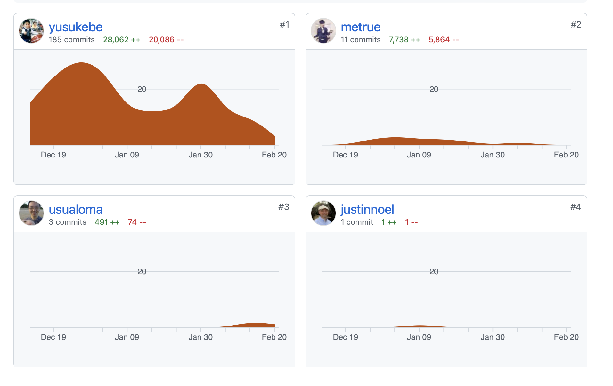
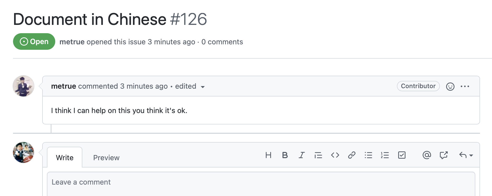
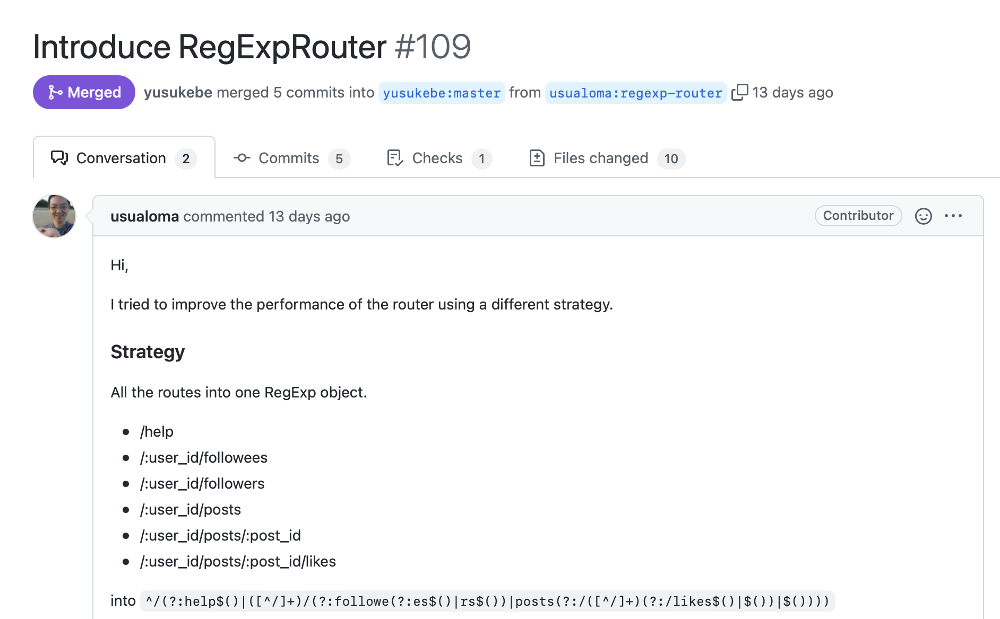
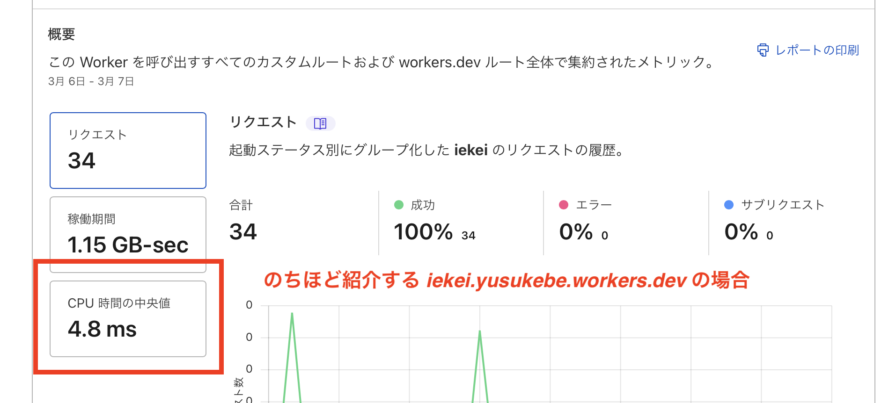
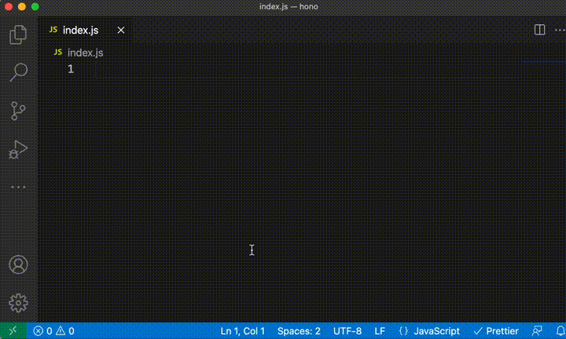
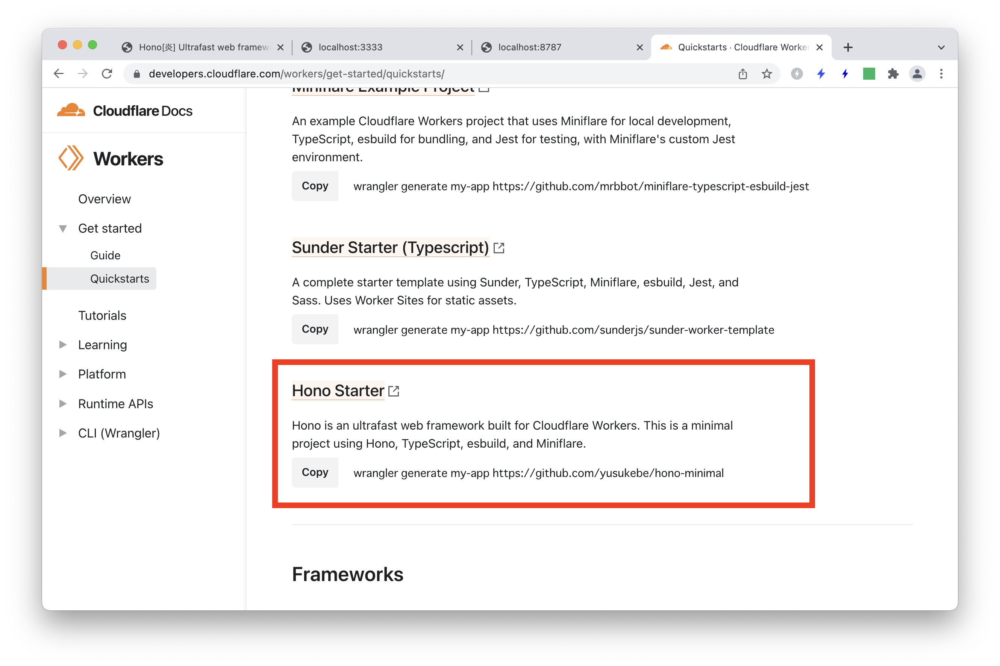
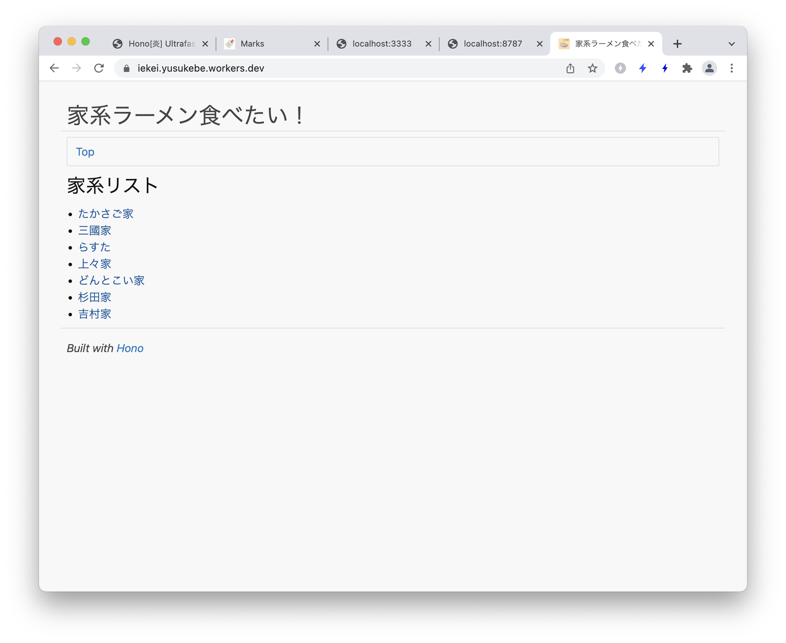
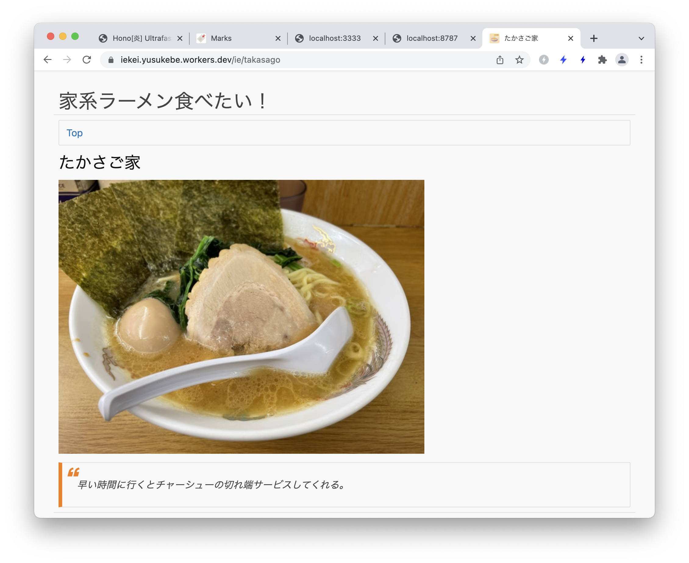
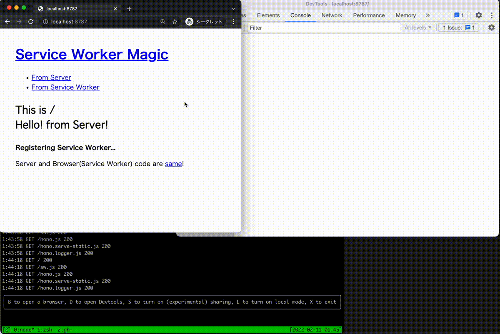

# Hono\[炎\] Ultrafast web framework for Cloudflare Workers.

Yusuke Wada

2022-03-05 YAPC::Japan::Online 2022

---

## 今日話すこと

1. Cloudflare Workers
2. Honoの特徴
3. HonoのAPI
4. Honoを使う
5. Service Worker Magic

---

# はじめに

---

### `Initial commit`は2.5ヶ月前

2021-12-15


---

### 現在のVersion

`v0.5.1`

---

### Contributors



---



---



---

作るの楽しい！！

---

# Cloudflare Workersについて

---

Cloudflareの**CDNエッジ**で実行される**サーバーレス**環境

---

### 速い・短い・小さい

* コールドスタートなし
* CPU時間10ms(Free、Bundled)
* 1MB以内

---

### CPU時間

スクリプトが実行中でCPUリソースを使用している時間。



---

### その他のキーワード

* Workers KV
* Workers Durable Objects
* Workers Sites
* Cache API
* CDNのキャッシュコントロール

---

## ユースケース

---

### 1.PC/SPの振り分け

```js
let isMobile = false
const userAgent = request.headers.get("User-Agent") || ""
if (userAgent.match(/(iPhone|Android|Mobile)/)) {
  isMobile = true
}

const device = isMobile ? "Mobile" : "Desktop"

const cacheUrl = new URL(request.url + "-" + device)
const cacheKey = new Request(reqeust.url + device, request)
const cache = caches.default

let response = await cache.match(cacheKey)
```

---

### 2.Slackスラッシュコマンド

```js
const karma = async (name: string, operation: string) => {
  const key = PREFIX + name
  const karm = await KV_KARMA.get(key)

  if (operation == "++") {
    karma = karma + 1
  } else {
    karma = karma - 1
  }
  await KV_KARMA.put(key, karma)

  return `${name} : ${karma}`
}
```

---

### 3.ブックマークアプリ

<https://github.com/yusukebe/marks>


---

## Worker

---

### 特徴というか制限

* JavaScript (Rustもサポート)
* Node.jsではない
* APIが限られている

---

## Service Workerで書く

---

### Service Workerとは？

> Service Worker はブラウザが Web ページとは別にバックグラウンドで実行するスクリプトで、Web ページやユーザーのインタラクションを必要としない機能を Web にもたらします。
> https://developers.google.com/web/fundamentals/primers/service-workers?hl=ja

---

* プッシュ通知
* オフラインでも閲覧できる
* バックグラウンドのデータ同期
* キャッシュ

---

### `fetch`イベントを書く

```js
const handleRequest = async (request) => {
  return new Response("Hello YAPC!")
}
addEventListener("fetch", event => {
  event.respondWith(handleRequest(event.request))
})
```

---

## つかえるAPI

* Encoding
* Fetch / FetchEvent
* HTMLRewriter
* Headers
* Request / Response
* Streams
* Web Crypto
* Web standards
* WebSockets
* Cache / KV / Durable Objects

---

Fastly Compute@Edgeでも同じコードが動くことがある

---

## Wrangler

* 開発〜デプロイ
* `wrangler dev`
* `wrangler publish`

---

## ちなみにPerlで書ける

---

### Perlito

```perl
JS::inline('addEventListener("fetch", event => { p5cget("main", "listener")([event]) })');
```

---

```perl
my $url = URL->new($req->url);
my $query_string = $url->search;
...
my $headers = Headers->new();
...
return Response->new(
  $msg,
    {
      status  => 200,
      headers => $headers
    }
);
```

---


Cloudflare Workers🔥でもPerl🐫でも動くPerlを書く

<https://yusukebe.com/posts/2021/psgi-cloudflare-workers/>

---

# Honoについて

---

## 1分で分かるHono



---

### ４ステップで開発〜デプロイ


```sh
$ yarn init -y
$ wrangler init
$ touch index.js // Write code
$ wrangler publish
```

`{project-name}.{user-name}.workers.dev`

---

# Honoの特徴

---

### モチベーション

「Webサイトを作ろうとしていたら、フレームワークを作っていた」

---

他にも...Cloudflare向けのルーター・フレームワーク

* itty-router - 37行
* Sunder - 先発
* worktop - Cloudflareの中の人が作ってる

---

### アイデンティティを探す

---

### 「Features」

---

* **Ultrafast**
* Zero dependencies
* Middleware
* Optimized
* (TypeScript)

---

## Ultrafast

---

## ベンチマーク

---

### TrieRouter

---

```plain
hono x 779,197 ops/sec ±6.55% (78 runs sampled) <---
itty-router x 161,813 ops/sec ±3.87% (87 runs sampled)
sunder x 334,096 ops/sec ±1.33% (93 runs sampled)
worktop x 212,661 ops/sec ±4.40% (81 runs sampled)
Fastest is hono
```

---

### Utrafast!

---

### RegExpRouter

---

```plain
hono x 723,504 ops/sec ±6.76% (63 runs sampled)
hono with RegExpRouter x 934,401 ops/sec ±5.49% (68 runs sampled) <---
itty-router x 160,676 ops/sec ±3.23% (88 runs sampled)
sunder x 312,128 ops/sec ±4.55% (85 runs sampled)
worktop x 209,345 ops/sec ±4.52% (78 runs sampled)
Fastest is hono with RegExpRouter
```

---

### Utrafast!!!

---

他の`node.js`ルーターと比べても...

---

* 有名どころに圧勝

```plain
express benchmark (includes handling) x all together: 292,090 ops/sec
koa-router benchmark x all together: 232,845 ops/sec
hono RegExpRouter benchmark x all together: 1,426,009 ops/sec <---
```

---

* `find-my-way`に勝った => Frameworkよりだから遅い
* `trek-router`に負けた => RegexとMulti paramに対応しない
* `hono RegExpRouter` => RegexとMulti paramに対応

```plain
find-my-way benchmark x all together: 1,059,323 ops/sec
trek-router benchmark x all together: 1,439,378 ops/sec
hono RegExpRouter benchmark x all together: 1,426,009 ops/sec <---
```

---

ほぼ最強

---

## なぜそんなに速いのか？ 

---

### TrieRouter

Inspired by **goblin**.

* [bmf-san/goblin: A golang http router based on trie tree.](https://github.com/bmf-san/goblin)
* [bmf-tech - GolangでgoblinというURLルーターを自作した](https://bmf-tech.com/posts/Golang%E3%81%A7goblin%E3%81%A8%E3%81%84%E3%81%86URL%E3%83%AB%E3%83%BC%E3%82%BF%E3%83%BC%E3%82%92%E8%87%AA%E4%BD%9C%E3%81%97%E3%81%9F)


---

トライ木

```js
class Node<T> {
  method: string
  handler: T
  children: Record<string, Node<T>>
}
```

---

### RegExpRouter

Inspired by **Router::Boom**.

[Introduce RegExpRouter #109](https://github.com/yusukebe/hono/pull/109) by @usualoma

---

全てのルートをひとつの大きな正規表現にする

* /help
* /:user_id/followees
* /:user_id/followers
* /:user_id/posts
* /:user_id/posts/:post_id
* /:user_id/posts/:post_id/likes

```plain
^/(?:help$()|([^/]+)/(?:followe(?:es$()|rs$())|posts(?:/([^/]+)(?:/likes$()|$())|$())))
```

---

だからHonoは速い

---

## その他の特徴

---

## Request/Responseの扱い

---

### Perlの場合

例えば`Plack`を使う

```perl
use Plack::Request;
 
my $app = sub {
    my $env = shift;
    my $req = Plack::Request->new($env);
 
    my $path_info = $req->path_info;
    my $query     = $req->parameters->{query};
 
    my $res = $req->new_response(200);
    $res->finalize;
};
```

---

Request/Responseオブジェクトつくりがち

---

### Cloudflare Workersの場合

そもそもRequest/Responseオブジェクトが提供されている

```js

const handleRequest = (req: Request) => {
  const ua = req.headers.get('User-Agent')
  new res = new Response(`You are ${ua}`, {
    headers: {
      'X-Message': 'Hello YAPC!',
    }
  })
  return res
}
```

---

### Contextがショートカットを提供する

* `c.req.header(name)`
* `c.header(name, value)`
* `c.json(object)`

```js
app.get('/hello', (c) => {
  const ua = c.req.header('User-Agent')
  c.header('X-Message', 'Hello YAPC!')
  return c.json({ 'You are ': ua })
})
```

---

## Middleware

---

### Inspired by `koa`

> Everything is middleware
> \- "Koa"


---

### Middlewareを書く

```js
app.use('*', async (c, next) => {
  const start = Date.now()
  // ^--- handle request
  await next() // <--- dispatch handler
  // v--- handle response
  const ms = Date.now() - start
  c.header('X-Response-Time', `${ms}ms`)
})

// a handler
app.get('/hello', (c) => c.text('Hello YAPC!'))
```

---

HandlerをMiddlewareが包む

---

```js
app.use('*', async (c, next) => {
  console.log('Foo - before')
  await next()
  console.log('Foo - after')
})

app.use('*', async (c, next) => {
  console.log('Bar - before')
  await next()
  console.log('Bar - after')
})
```

---

```js
app.get('/hello', (c) => {
  console.log('Handler')
  return c.text('Hello YAPC!')
})
```

---


---

# HonoのAPI

---

## `app`

* app.HTTP_METHOD(path, handler)
* app.all(path, handler)
* app.route(path)
* app.use(path, middleware)
* app.notFound(handler)
* app.onError(err, handler)
* app.fire()
* app.fetch(request, env, event)

---

## Routing

---

### `app.HTTP_METHOD` / `app.all`

```js
// HTTP Methods
app.get('/', (c) => c.text('GET /'))
app.post('/', (c) => c.text('POST /'))

// Wildcard
app.get('/wild/*/card', (c) => {
  return c.text('GET /wild/*/card')
})

// Any HTTP methods
app.all('/hello', (c) => c.text('Any Method /hello'))
```

---


### Named Parameter

```js
app.get('/user/:name', (c) => {
  const name = c.req.param('name')
  ...
})
```

---


[Added type to c.req.param key. #102](https://github.com/yusukebe/hono/pull/102) by @usualoma

---

### Regexp

```js
app.get('/post/:date{[0-9]+}/:title{[a-z]+}', (c) => {
  const date = c.req.param('date')
  const title = c.req.param('title')
  ...
```

---

### Nested route

```js
const book = app.route('/book')
book.get('/', (c) => c.text('List Books')) // => GET /book
book.get('/:id', (c) => {
  // => GET /book/:id
  const id = c.req.param('id')
  return c.text('Get Book: ' + id)
})
book.post('/', (c) => c.text('Create Book')) // => POST /book
```

---

### no strict

If `strict` is set `false`, `/hello`and`/hello/` are treated the same:

```js
const app = new Hono({ strict: false })

app.get('/hello', (c) => c.text('/hello or /hello/'))
```

---

## async/await

```js
app.get('/fetch-url', async (c) => {
  const response = await fetch('https://example.com/')
  return c.text(`Status is ${response.status}`)
})
```

---

## Middleware

---

### Builtin Middleware

```js
import { Hono } from 'hono'
import { poweredBy } from 'hono/powered-by'
import { logger } from 'hono/logger'
import { basicAuth } from 'hono/basicAuth'

const app = new Hono()

app.use('*', poweredBy())
app.use('*', logger())
app.use('/auth/*', basicAuth({ username: 'hono', password: 'acoolproject' }))
```

---


### Available builtin middleware

* basic-auth <--- 1から作るとダルい
* body-parse
* cookie
* cors
* etag
* logger
* mustache <--- テンプレート
* powered-by
* serve-static <--- KVを使う

---

### Custom Middleware

```js
// Custom logger
app.use('*', async (c, next) => {
  console.log(`[${c.req.method}] ${c.req.url}`)
  await next()
})

// Add a custom header
app.use('/message/*', async (c, next) => {
  await next()
  await c.header('x-message', 'This is middleware!')
})

app.get('/message/hello', (c) => c.text('Hello Middleware!'))
```
---

## Not Found

```js
app.notFound((c) => {
  return c.text('Custom 404 Message', 404)
})
```

---

## Error Handling

```js
app.onError((err, c) => {
  console.error(`${err}`)
  return c.text('Custom Error Message', 500)
})
```

---

## Context

---

### c.req

```js
app.get('/shortcut', (c) => {
  const userAgent = c.req.header('User-Agent')
  ...
})

app.get('/search', (c) => {
  const query = c.req.query('q')
  ...
})

app.get('/entry/:id', (c) => {
  const id = c.req.param('id')
  ...
})
```

---

### Shortcuts for Response

```js
app.get('/welcome', (c) => {
  c.header('X-Message', 'Hello!')
  c.header('Content-Type', 'text/plain')
  c.status(201)

  return c.body('Thank you for comming')
})
```

---

以下と同じ

```js
return new Response('Thank you for comming', {
  status: 201,
  statusText: 'Created',
  headers: {
   'X-Message': 'Hello',
    'Content-Type': 'text/plain',
    'Content-Length': '22'
  }
})
```

---

### c.text()

Render text as `Content-Type:text/plain`:

```js
app.get('/say', (c) => {
  return c.text('Hello!')
})
```

---

### c.json()

Render JSON as `Content-Type:application/json`:

```js
app.get('/api', (c) => {
  return c.json({ message: 'Hello!' })
})
```

---

### c.html()

Render HTML as `Content-Type:text/html`:

```js
app.get('/', (c) => {
  return c.html('<h1>Hello! Hono!</h1>')
})
```

---

### c.redirect()

Redirect, default status code is `302`:

```js
app.get('/redirect', (c) => c.redirect('/'))
app.get('/redirect-permanently', (c) => c.redirect('/', 301))
```

---

### c.res

```js
// Response object
app.use('/', (c, next) => {
  next()
  c.res.headers.append('X-Debug', 'Debug message')
})
```

---

### c.event

```js
// FetchEvent object
app.use('*', async (c, next) => {
  c.event.waitUntil(
    ...
  )
  await next()
})
```

---

### c.env

```js
// Environment object for Cloudflare Workers
app.get('*', async c => {
  const counter = c.env.COUNTER
  ...
})
```

---

## fire

`app.fire()` do:

```js
addEventListener('fetch', (event) => {
  event.respondWith(this.handleEvent(event))
})
```

---

## fetch

`app.fetch()` is for Cloudflare Module Worker syntax.

```js
export default {
  fetch(request: Request, env: Env, event: FetchEvent) {
    return app.fetch(request, env, event)
  },
}

/*
or just do this:
export default app
*/
```

---

# `use Hono`

---

### Hono Starter

```plain
wrangler generate my-app https://github.com/yusukebe/hono-minimal
```

---



---

```plain
.
├── README.md
├── package.json
├── src
│   └── index.ts
└── wrangler.toml
```

---

```js
  "dependencies": {
    "hono": "^0.5.1"
  },
  "devDependencies": {
    "esbuild": "^0.14.23",
    "miniflare": "2.2.0"
  }
```

---

### Hono Examples

* basic
* blog
* compute-at-edge
* durable-objects
* jsx-ssr
* serve-static

---

Not only for Web API

---

「家系ラーメン食べたい！」

---



---



---

### 家系ラーメン食べたい！

`mustache`ブランチ

* Hono
* `serve-static Middleware`
* `mustache Middleware`
* 開発・デプロイにWrangler 2.0

---

```js
import { Hono } from 'hono'
import { mustache } from 'hono/mustache'
import { serveStatic } from 'hono/serve-static'
import { ies } from './ies'
```

---

```js
app.use('*', mustache({ root: 'view' }))
app.use('/static/*', serveStatic({ root: 'public' }))

app.use('/static/*', async (c, next) => {
  await next()
  if (c.res.headers.get('Content-Type').match(/image/)) {
    c.header('Cache-Control', 'public, max-age=86400')
  }
})
```

---

```js
const partials = { header: 'header', footer: 'footer' }

app.get('/', (c) => {
  return c.render('index', { ies: ies }, partials)
})

app.get('/ie/:name', (c) => {
  const name = c.req.param('name')
  const ie = ies.find((i) => i.name === name)
  if (!ie) return c.notFound()
  return c.render('ie', ie, partials)
})
```

---

```js
app.fire()
```

---

### 家系ラーメン食べたい！

`react`ブランチ

* Honoを使っている
* ReactSSRしている（クライアントは何もしてない）
* microCMSでコンテンツを管理
* APIレスポンスはKVでキャッシュ
* Webhookを受け取って、キャッシュをパージ
* 開発にmifnilare 2.x、デプロイにはWrangler 2.0

---

CDNエッジでも「ちゃんとした」Webがつくれる

---

<https://iekei.yusukebe.workers.dev/>

---

# Service Worker Magic

---

* Server (Cloudflare Workers) code is `sw.js`.
* Browser ( Service Worker ) code is `sw.js`.
* Cloudflare Workers `sw.js` serves `sw.js`.
* Service Worker `sw.js` is registered on `/`.
* The scope is `/sw/*`.
* `/server/hello` => from the server.
* `/sw/hello` => from the browser.
* Request is intercepted by Service Worker.

---



---

<https://service-worker-magic.yusukebe.workers.dev>

---

## Enjoy Hono!

<https://github.com/yusukebe/hono>

---

おしまい